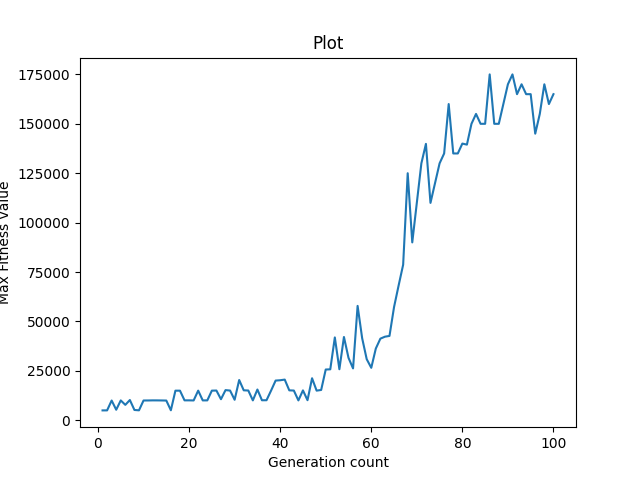

## Problem Definition
Train an agent to play the **Snake Game** using **Genetic Algorithm**.

### Snake Game
Snake is the common name for a video game concept where the player maneuvers a line that grows in length, with the line itself being a primary obstacle. As the snake moves forward, it leaves a trail behind, resembling a moving snake. The player loses when the snake runs into the screen border, a trail, another obstacle, or itself. There are food items present on the screen, which keep popping at random places. As the snake eats the item, it grows in length, to make the game progressively difficult.

### Genetic Algorithm
Genetic Algorithm (GA) is a search-based optimization technique based on the principles of Genetics and Natural Selection. It is frequently used to find optimal or near-optimal solutions to difficult problems which otherwise would take a lifetime to solve. It is frequently used to solve optimization problems, in research, and machine learning.

## Analysis and Design of Problem
### Dataset
For training any Machine learning algorithm, we need a lot of data, which needs to be preprocessed before being fed to the Algorithm. While solving the Snake game using a Genetic Algorithm, the position of the snake is calculated using a Neural Networks, while the position of the apples is generated at random during real-time. The inputs of the Neural Network are the current position of the snake, its movement direction, position of obstacles, the position of the apple, and the direction of the apple from the snake. Thus, we do not need any external dataset for our problem statement. The entire input to the neural network is calculated in real-time depending on the current position of the snake. The offspring in the Genetic Algorithm is produced from their parents, using concepts taken from Natural Evolution, like Crossover and Mutation.
For the snake game, we let the snakes play the game for a certain number of generations and evolve. For each snake that plays the game, the environment’s state space which is sent to it, which consists of the following tuples:
- The direction of movement of the snake.
- The position of the food.
- The boundaries of the wall
- The direction of food from the snake

The snake then calculates its next movement direction by feeding these to a **3-layered Feedforward Neural Network**.
Initially, when the snake is untrained, it takes some iterations for it to learn that eating the food rewards it, and thus, slowly the snake learns an optimal behavior to avoid the walls and move towards the food. After the training, we can use the weights of the neural network to play the snake game.

## Learning Algorithm
Genetic Algorithm (GA) is a nature-inspired heuristic where we have a certain number of individuals (collectively called population) in each generation, which carry genes. Genes are used to determine how fit an individual (called chromosome) of the population is. To produce the next population, we select a few of the fittest chromosomes (ones with the highest fitness value) and directly pass them onto the next generation. For the rest of the population, we perform crossovers (using either probability or Roulette Wheel selection) and produce new offspring from two parents. We also perform mutation on a selected group of chromosomes.

### Genes
The genes of an individual in the snake problem are defined as the list of all the weights of the neural network that is used in the algorithm. The set of weights that give a higher performance (total score) is considered to have a higher fitness value.

### Neural Network
To evaluate the best direction of motion after each step, the snake sends its current state to a feedforward neural network. The neural network has 2 hidden layers, its output layer has 3 nodes, corresponding to the three directions – turn left, move straight, turn right, while the input takes the current state space. Three probabilities corresponding to each movement are returned, and the snake performs the one with the highest probability. The number of nodes in the hidden layer is chosen on a test basis. Since the training is taking a lot of time, we were not able to perform lots of test cases, so another permutation might yield better results.

### Fitness Value
To calculate the fitness value of a chromosome, we let the chromosome play the game. The total score is defined as the number of apples eaten by the snake in that iteration and has a very high weightage in the fitness value. If the snake collides with a wall or its body, we give it a negative score. Also, if the snake goes on in the same direction for a very long amount of time, we give it a small negative score, to promote exploration in the algorithm. From the above-mentioned criteria, we calculate the total fitness value of the snake for that generation.

### Selection
The idea of the selection phase is to select the fittest individuals and let them pass their genes to the next generation. Two pairs of individuals (parents) are selected based on their fitness scores. Individuals with high fitness have more chances to be selected for reproduction.

### Crossover
From the current generation, we choose a percentage of the population that has the best fitness value, and perform crossover amongst them, to produce the rest of the new population. The best ones are also directly included in the new population. We use the uniform crossover technique, where we take a gene from either of the parents at random and give it to the new child. Since the genes represent weights of the neural network, this might produce a child which is even fitter than both the parents.

### Mutation
Mutation may be defined as a small random tweak in the chromosome, to get a new solution. It is used to maintain and introduce diversity in the genetic population and is usually applied with a low probability – pm. If the probability is very high, the GA gets reduced to a random search. Mutation is the part of the GA which is related to the “exploration” of the search space. It has been observed that mutation is essential to the convergence of the GA while crossover is not.

## Performance
Initially, when the snakes are untrained, the initial weights of the neural network give random output, and the snake dies before even eating one apple. Slowly as the training progresses, we see that the fitness value of each chromosome increases, and especially the maximum fitness value in each generation witnesses a large growth after a certain number of generations. After the entire training, the snake has learnt to behave optimally, avoid its body and walls, and move towards the food in an optimum manner. On plotting a graph for the maximum fitness value of each generation, we see a graph with a positive slope, indicating that the neural networks have adapted to the game. Here are some outputs for different hyperparameters we used:

A.	mutation intensity = 0.1 % of total genes of a chromosome
Here, we have selected 0.1% of genes in each chromosome and applied mutation on them. The graph is flat with very high variation after each generation for the fitness value.

B.	mutation intensity = 10 % of total genes of a chromosome
Here, we have selected 10 % of genes in each chromosome and applied mutation on them. The fitness value continuously improves in each generation, and the graph has a positive average slope.

C.	mutation intensity = 1% of total genes of a chromosome
Here, we have selected 1 % of genes in each chromosome and applied mutation on them. The fitness value continuously improves in each generation, and the graph has a positive average slope. The graph is more consistently improving than B.

D.	mutation = 1 gene in a chromosome
Here, we have selected 1 gene at random in each chromosome and applied mutation only on it. The fitness value is very low and the graph is highly variable.

E.	mutation intensity = 10% of total genes in a chromosome but the same genes can be repeated.
Here, we have selected 10% number of total genes at random with replacement, in each chromosome and applied mutation only on it. The graph is highly variable, and cannot be trusted in all cases. Although high peaks are obtained, the snake isn’t able to keep up with the improvement and keeps losing progress.

## Conclusion
From the above data and graphs, we can see how the snake has over several generations learnt to avoid walls and its body and eat apples. The fitness value increases in an overall fashion, and so does the maximum score of each snake. For mutation intensity of 1% and 10%, the results are most favorable. Hence, we can conclude that for very low mutation intensity (0.1%), the learning rate is very slow and highly variable. Mutation rate can’t be very high, else it would lead to a random search. Thus, for our problem, a mutation probability of 1-10% is highly favorable.

## Code Structure
main.py -  to start training the snake game using genetic algorithm
Snake_Game.py  -  contains the logic for creating snake game using pygame
Run_Game.py  -  play snake game using predicted directions from the genetic algorithm
Genetic_Algorithm.py  -  contains genetic algorithm functions like crossover, mutation, etc.
Feed_Forward_Neural_Network.py  -  contains the functions for calculating the output from feed-forward neural network
